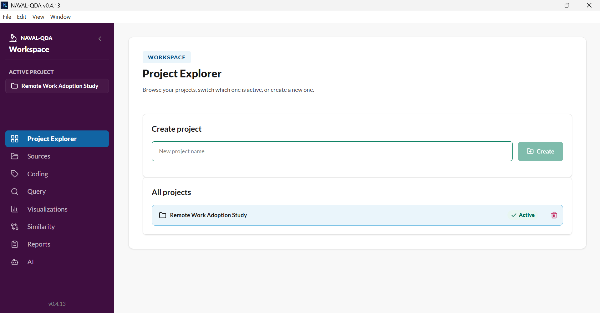
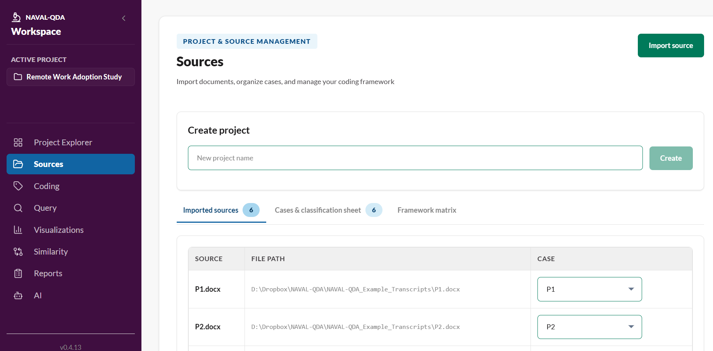
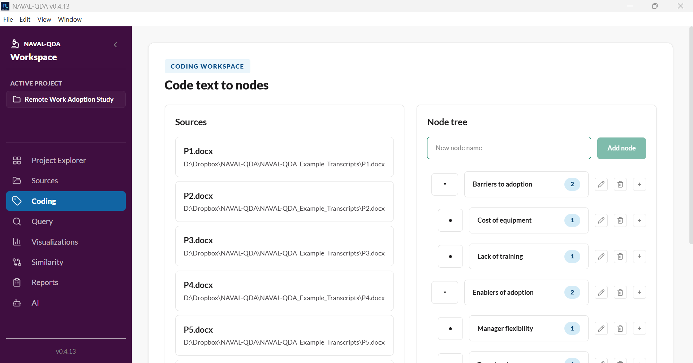
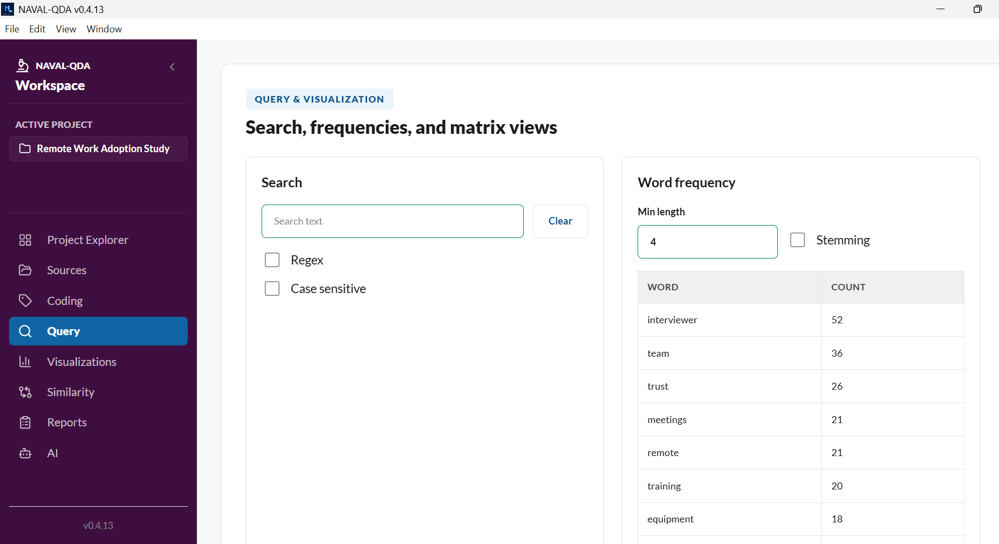
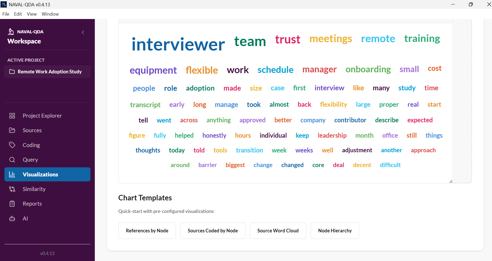
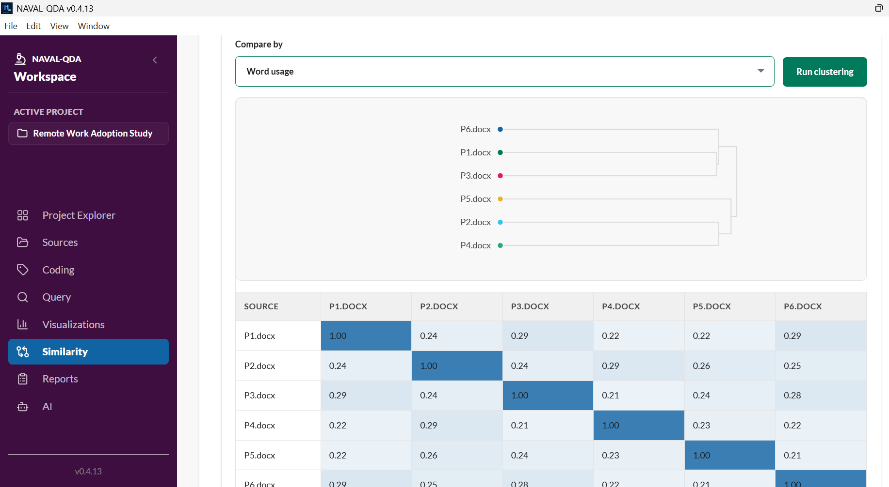
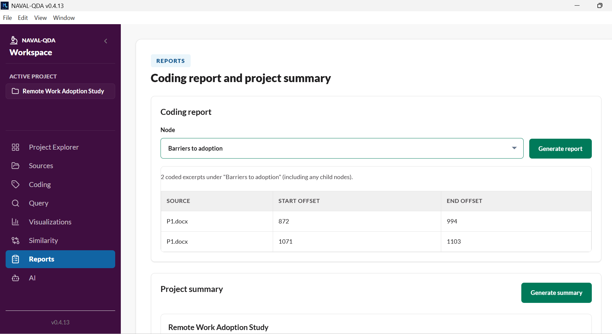
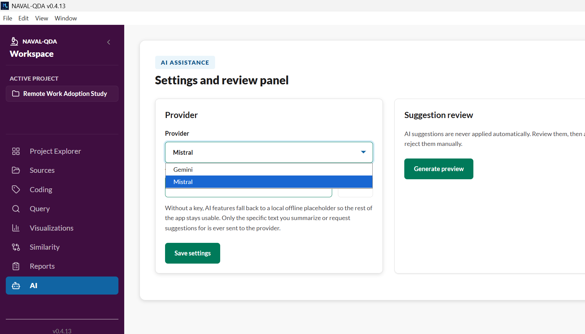

# NAVAL-QDA feature tour

A walkthrough of the current app (v0.4.13), screen by screen. For install instructions and the full feature reference, see the [README](../README.md) and the [user guide](guide.html).

---

## Project Explorer

Every project lives in one place — browse existing projects, switch which one is active, or create a new one. Creating a project doesn't automatically switch you into it (unless it's the very first project you've made), so starting a new study doesn't yank you out of the one you're currently coding.

## Sources

Import `.txt`, `.docx`, and `.pdf` documents (plus audio/video for transcription), and link each one to a case. The sources list is a compact table — file path and case assignment are visible for every source at a glance, and the case dropdown reflects each source's actual current link rather than always showing as unselected.

## Coding

Select text in a source and code it to a node. The node tree on the right supports creating child nodes, renaming a node in place, deleting a node (with a confirmation step — and an explicit prompt if it has children, so you can choose to delete the whole subtree), moving, and merging. Each node shows its live coding count.

## Query

Full-text search (with optional regex and case-sensitive matching) and word-frequency analysis, with configurable minimum word length and stemming.

## Visualizations

An interactive dashboard — word clouds, hierarchy treemaps, and bar/pie charts you can drag to resize. Chart templates below give you a quick-start on the most common views (references by node, sources coded by node, source word cloud, node hierarchy).

## Similarity clustering

Compare sources by word usage or by coding pattern. The dendrogram at the top shows how sources cluster together; the matrix below shows the pairwise similarity score behind it, with an expandable explanation of the underlying Jaccard-distance calculation.

## Reports

Generate a coding report for any node — including every excerpt coded to its child nodes, not just the node itself — or a full project summary.

## AI assist

Optional source summarization and child-code suggestions, backed by your choice of Gemini or Mistral. Nothing is sent anywhere without an API key configured, and without one the app falls back to local placeholder output so the rest of the app stays fully usable. Suggestions are never applied automatically — every one is reviewed and accepted or rejected manually.

---

*Screenshots taken from v0.4.13. UI details may have changed slightly in newer releases — check the [Releases page](https://github.com/navalsingh9/naval-qda/releases) for what's current.*
